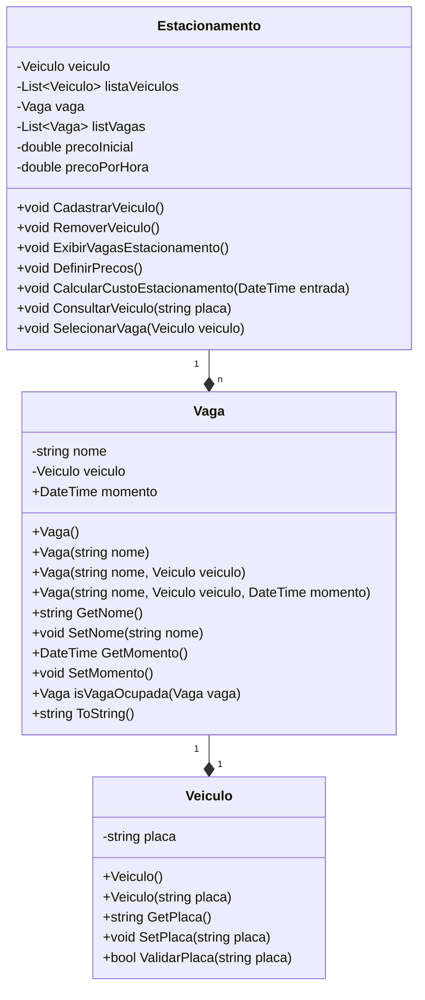

# dio-desafio-sistema-estacionamento
DIO Desafio de projeto - Sistema para estacionamento em C#

## Autor
- [Felipe Figueiredo Bezerra](https://github.com/FigFelipe)

## Ambiente de Desenvolvimento

 - **IDE**: Visual Studio Code (Community Edition)
 - **SDK:** .NET 8.0

## Resumo
Desenvolver um sistema básico de gerenciamento para um estacionamento, utilizando .NET e C#.

Onde:

* O estacionamento deve conter uma 'Vaga' e um 'Veículo' estacionado
* Escolha uma vaga deseja, informando o veículo à ser estacionado 
* Consulte os veículos estacionados
* Defina os preços, e calcular o custo de um veículo estacionado
* Remover um veículo estacionado

#### Funções essenciais

| Função             | Descrição                                                                 |
|--------------------|---------------------------------------------------------------------------|
| Cadastrar veículo  | Adiciona um novo veículo mediante a placa informada                       |
| Remover veículo    | Remove o veículo mediante a placa informada                               |
| Listar veículo(s)  | Lista os veículos estacionados                                            |
| Definir preço(s)   | Define os preços iniciais e adicional por hora pelo uso do estacionamento |
| Encerrar aplicação | Finaliza a aplicação (os dados de execução não retentivos)                |

#### Formato na entrada de Placas

* O programa possui um validador de placas de acordo com as regras do DETRAN
* As placas podem ser informadas no padrão antigo e padrão mercosul.
* (Opcional) Pode ser utilizado o '-' (hífen) ou não.

| Placa     | Descrição                   |
|-----------|-----------------------------|
| ABC-1234  | Padrão antigo (com hífen)   |
| ABC-1C34  | Padrão mercosul (com hífen) |
| ABC1234   | Padrão antigo               |
| ABC1C34   | Padrão mercosul             |

### Diagrama de Classes - UML

